# Binary Formats

<!-- toc -->

## The Glyph Header

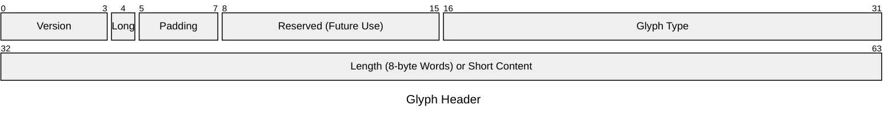

- __Version__. A 4-bit unsigned integer describing the version of GLIFS. 
  Currently, these bit must all be set to zero.
- __Padding__. A 3-bit unsigned integer describing the amount of zero-padding
  at the end of a glyph.  As the length field specifies the length of the
  content section in increments of 8 bytes, glyphs with content requiring a
  specific byte length are required to be zero-padded.  For example, if storing
  a 13-byte UTF string, the content length field would be equal to 2 (16 bytes)
  and the padding bits would be set to `011` (3).
- __Long Bit__. If this bit is set to zero, the content length field is 
  ignored, and 4 bytes of data can be stored in that field instead.  If the bit
  is set to one, then the content length field is interpreted normally (see
  below).
- __Glyph Type__.  A little-endian 16-bit unsigned integer describing the type 
  of data stored in the content section.  In the experimental version of GLIFS,
  this list is stored in the `enum GlyphType` in `glyph.rs`. 
- __Content Length (or Data)__.  The interpretation of this field depends on the
  value of the long bit.  If the long bit is set to 1, this indicates that the
  field contains the length of the content section of the glyph, in multiples
  of 8 bytes, stored as an unsigned, little-endian, 32-bit integer.

Note that glyphs are always a multiple of 8-bytes long, so that we can guarantee
alignment (up to 8 bytes) when necessary.

## Unit Glyphs

Unit glyphs are used to represent unit types, that is, types that hold only one value and thus no information.  In other words, these are types for which we are only interested in knowing the specific type but do not need to store any data apart from the type identifier.  See the [wikipedia article](https://en.wikipedia.org/wiki/Unit_type) for a short description.

One of the most common use of the unit type is probably as the value for `Option::None`, used but other kinds of unit types can also be useful.

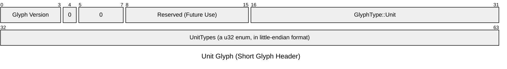

## Boolean Glyphs

A single true/false value.  As a short glyph, the "long bit" is set to zero and the contents are placed in the length field.  Can be found in `basic.rs` as the type `BoolG`.

### Bit Vector Glyphs

An array of bits.  Could be used, e.g., for storing bloom filter data.  Can be found in `basic.rs` as the type `BitVecG`.

- The first byte of the contents section is used to store an adjustment
  to the number of bits in the vector, so the length can be exact and 
  not just a multiple of 8.
- The rest of the bytes in the content section contain the bit vector
  itself, with the first bit index in every byte starting at the most 
  significant bit.
- An exact number of bits can be specified by taking the number of bytes
  in the unpadded content section, subtracting one, multiplying by eight, 
  and subtracting the three least significant bits of the first byte of the contents section.
- Alternatively, the contents section can be completely empty, which is
  interpreted as an empty bit vector.

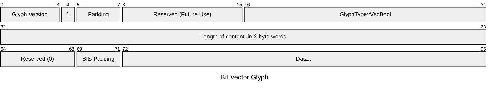

## Numeric Glyphs

Currently, numeric types are spearated into three types--signed, unsigned, and floating point.  Different lengths are supported based on the length of the glyph itself, with 32-, 64-, and 128-bit versions supported for integer types, and 32- and 64-bit versions are supported for floating point types.  See `basic::IntG`, `basic::UIntG` and `basic::FloatG` for more details.

Additionally, as the overhead of a glyph header and type checking would be unreasonable when dealing with numeric arrays, more specific arrays can currently be used with a generic zero-copy vector for simple fixed-length types.  See `basic::ZcVecG` for more information.  Feedback is requested on the possibility of a better way of presenting this to users as an API.

Example: 32-bit Unsigned Integer.  

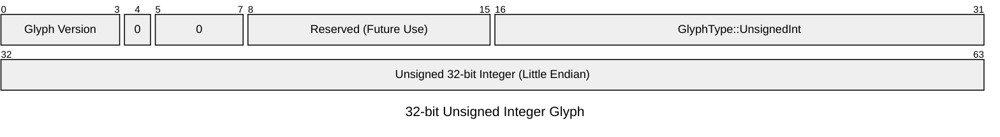

Example: 128-bit Signed Integer

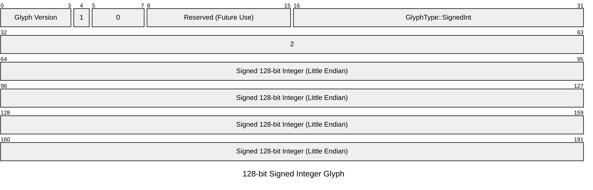

Example: 64-bit Floating Point

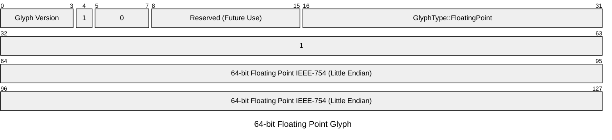

Ideas for additional numeric data types in the future include currency, dimensioned tensors, imaginary numbers, large decimals, and so on.

## Language Types

Strings are encoded in UTF-8, with additional metadata for language and locale.  Feedback is requested on whether encodings other than `UTF-8` should be supported, as well as the proper collation method.  

### String Glyphs

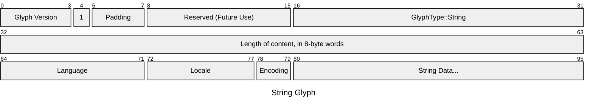

The default collation method for the `str` type in rust is language-unaware bytewise comparison, but unicode sorting using the default locale seems like it would be preferable.  Currently, string collation is performed with the `icu_collcation` crate using the default collation options and locale.

The value of the language correspond with `enum Language` in `lang.rs`, while the full `enum Locale` depends on the `u16` value of those two bytes, with the bits for encoding masked off.  This allows us to easily get the language separately from the combined language / place locale.  It allows for 256 languages (the list I found had ~100) and up to 64 places per language (the list I found had a max of ~16 per language).  Feedback is requested whether this is the appropriate strategy for representing this information.

### Character Glyphs

Character glyphs currently reflect the rust type `char`, which the documentation referrs to as a "Unicode Scalar Value".

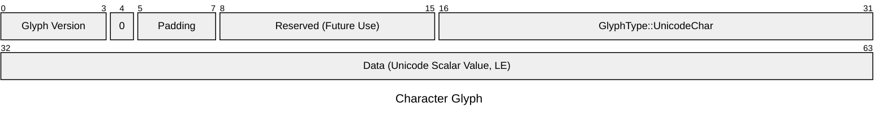

## Collections

Currently, four types of collations are provided.  Tuples, vectors, _basic_ vectors, and maps.  Plans for future development include a copy-on-write LSM/B-Tree hybrid based on a Merkle DAG, for creating indexes that can be shared and updated directly by cliets / peers without performing collation.

### Tuple Glyphs

Tuple Glyphs can contain an abitrary number of item glyphs, though they are intended to be used (1) with a relatively small number and (2) where all items will be decoded, as there is no random access to the individual items.  For the raw glyph type, see `collections::TupleG`.  Encoding and decoding is provided for rust tuples up to length 6.

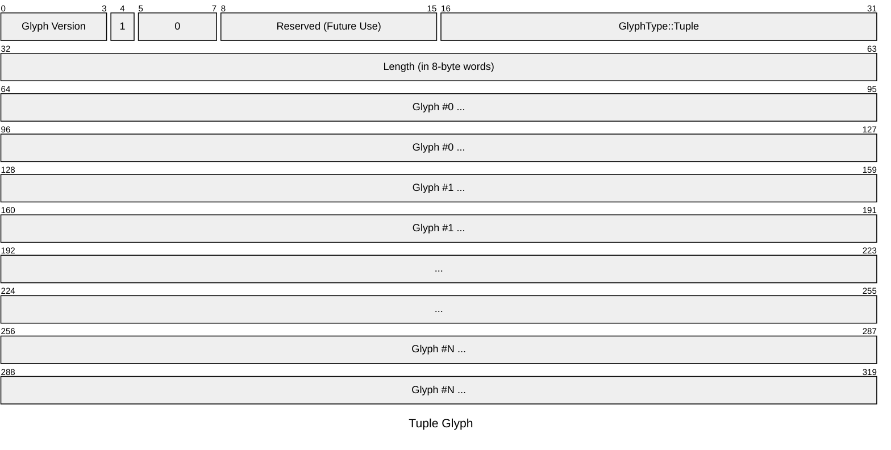

One minor point, tuples with zero items may also have bit 4 set to zero, though since no data is stored in either case the two glyphs would be the same size.

### Vector Glyphs

Vector glyphs differ from Tuple glyphs only in that an offsets table is provided to allow for random access within the vector.  This allows users to decode individual glyphs without also decoding every preceeding glyph.

Offsets are in the same units as the length field in the `Glyph` header, a `u32` that specifies a number of 8-byte words relative to the start of the glyph's content.  The number of items in the vector is specified with a `u32` at the start of the content section, followed by a vector of `u32` offsets.  If necessary (i.e., there are an even number of items), zero padding must be added at the end of the offsets table so that the first glyph starts on an 8-byte boundary.

See the `collections::VecG` type for more details.

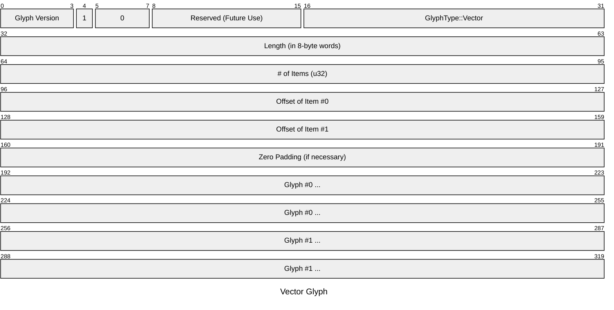

### Basic Vector Glyphs

Basic vector glyphs are intended for use when storing a large number of items of the same type and fixed length, so the storage and processing overhead of a glyph header for each item can be avoided.  Basic types are generally those that can be represented with a `[T; len]`, in a fixed-endian format, that require an alignment of `8` or less.

Basic vector glyphs are also useful for tensors, with a header that specifies a tensor rank and an optional array of `[u32]` to provide the sizes for each tensor dimension.  Feedback is welcome on whether this facility is useful.

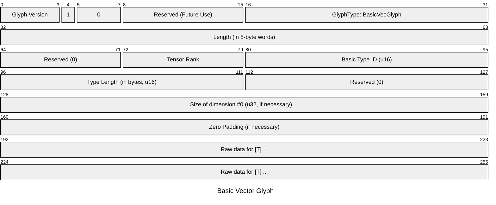

### Map Glyphs

Map glyphs are similar to vector glyphs, but for the fact that both a key and value are stored at each offset.

Ideally, maps should be written so that keys are in sorted order and therefore items can be found by key value with a binary search in `log(2)` time.  However, this is somewhat complex, as it currently would require either (1) ensuring that items are presented to the code that writes map glyphs provides the source types in the same order as the resulting glyphs would be sorted, or (2) buffering written key/value pairs so that they can be sorted and written to the map glyph after they've been converted to glyphs themselves.  Contributions are currently welcome along these lines.

See `collections::MapG` for more info.

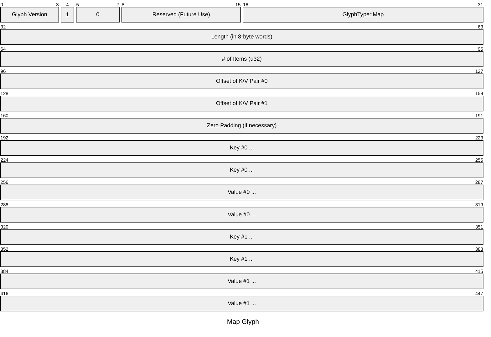

## Structured Types

### Document Glyphs

Document glyphs are for semi-structured information typical in a [document-oriented database](https://en.wikipedia.org/wiki/Document-oriented_database).  Document glyphs are a [conflict-free replicated data type](https://en.wikipedia.org/wiki/Conflict-free_replicated_data_type) (CRDT), or, a bit more accurately, provide a way to track and manage these conflicts to be resolved at the application layer.  

When multiple documents are written to a collection with the same ID, because collections are content-addressed there is no conflict between the two at the storage layer.  However, at the index layer, we can take note of the existence of two objects with the same ID and present them to the application layer to resolve the conflict.  Conflict resolution takes the form of a new document listing the hashes of the previous documents that it is replacing and the transaction in which it was committed to the collection.

(This is to ensure consistent operation with unordered updates that occur when data is updated in different partitions.  See the chapter on documents for more details.)

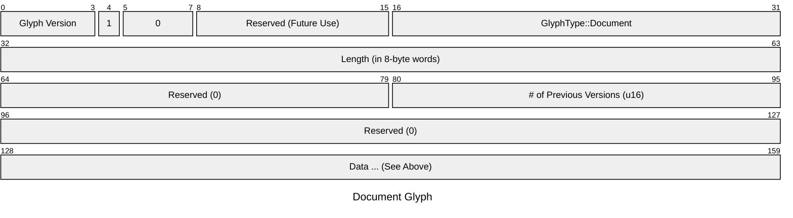

### Object Glyphs

